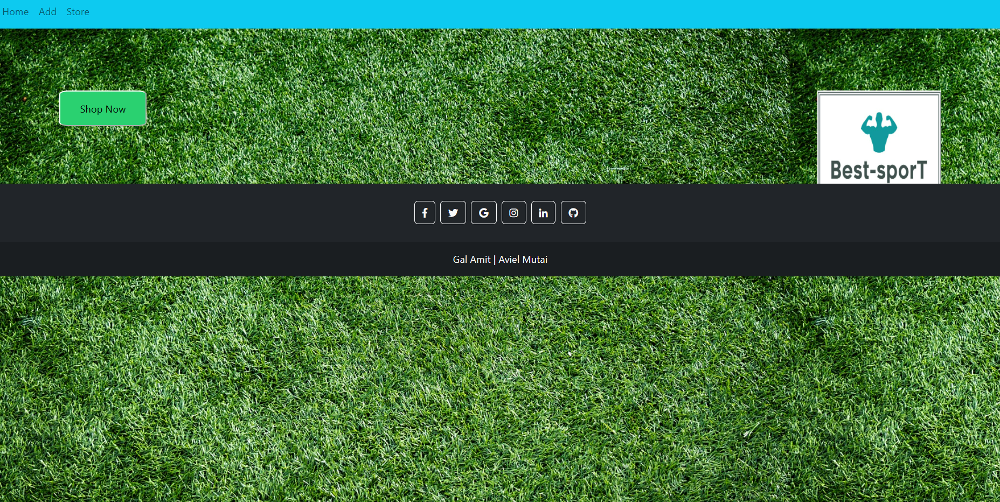
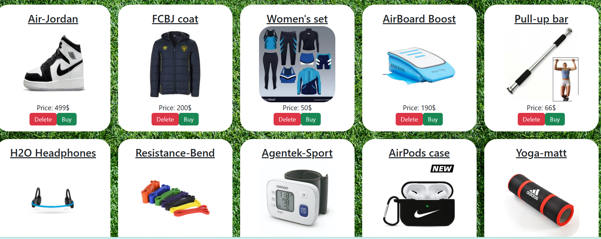
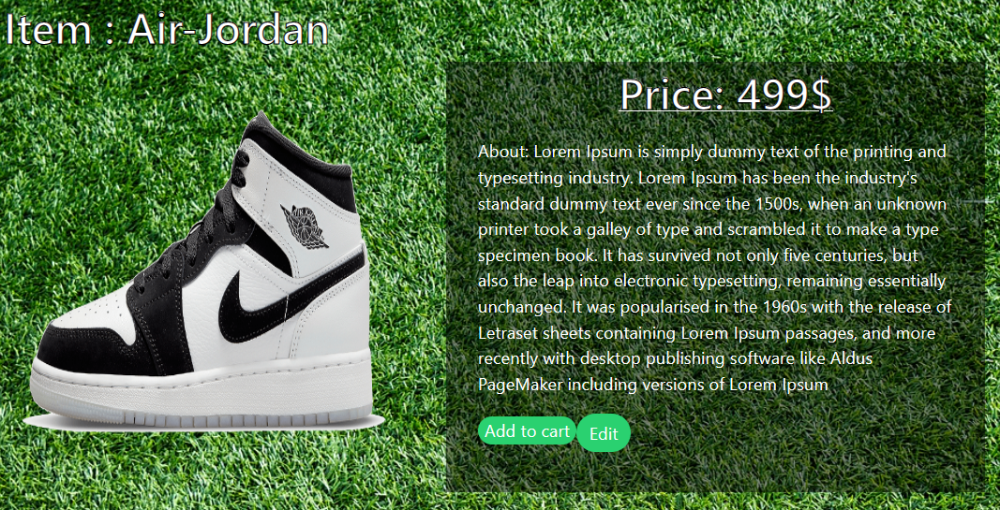
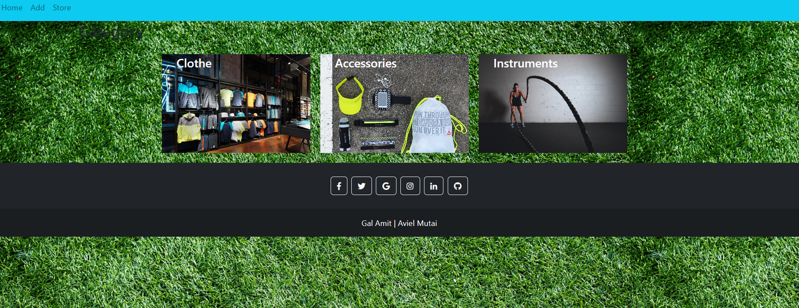

<h2 width="500" height="500">Welcome to out Sport-Store<h2/>

We have 4 pages

##Home
Main page 1 bottun that lead to all products pages

## All Products 
all the products in the store on one page.
Click on "buy" to see his details, click "delete" to delete item

## Item
item details

## Add 
You have the ability to add new product.
Adding name, category, img, price and about
Then click submit and it will be save in all product page.

 
 
## Store 
page of out three category of products, you can enter and see each category by clicking it
Also you enter each item or delete 

 
 

